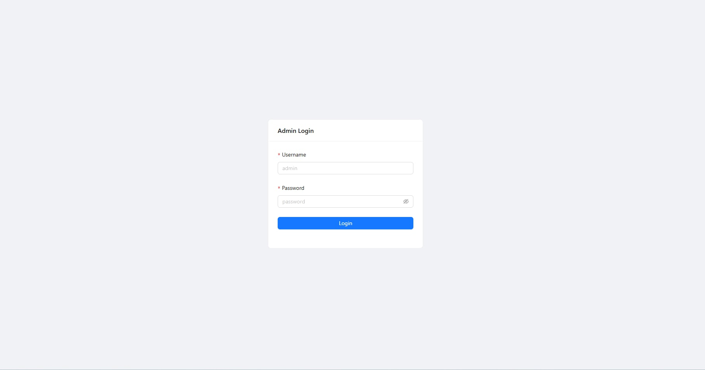
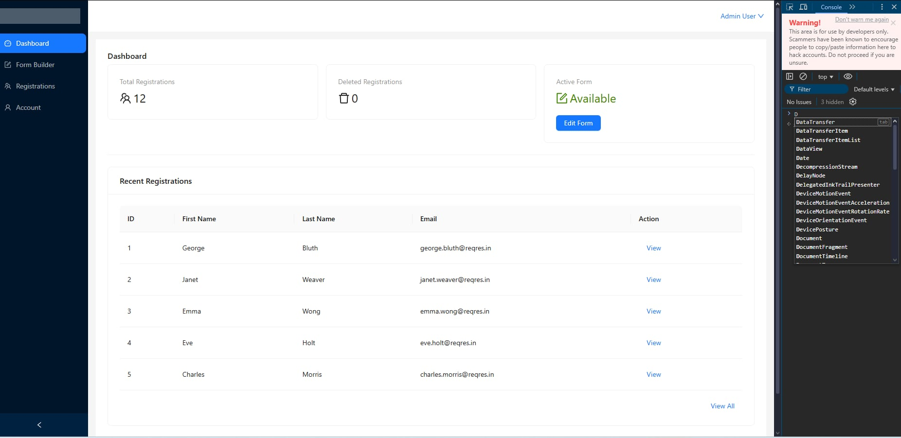
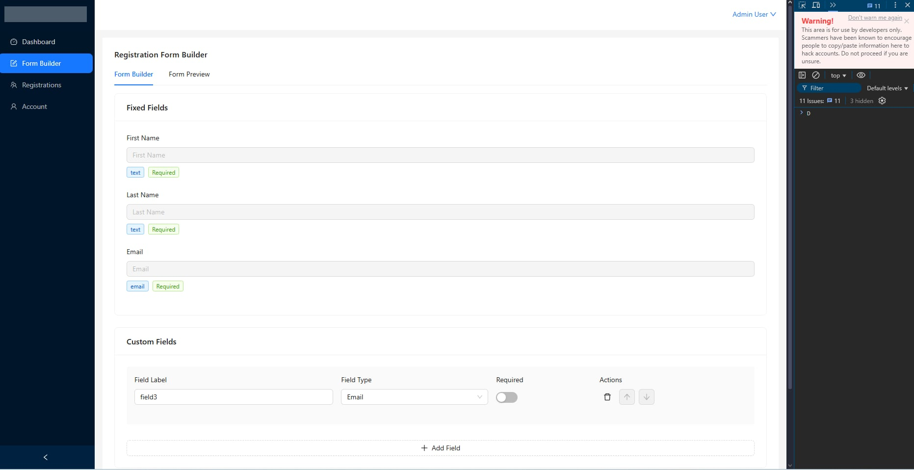
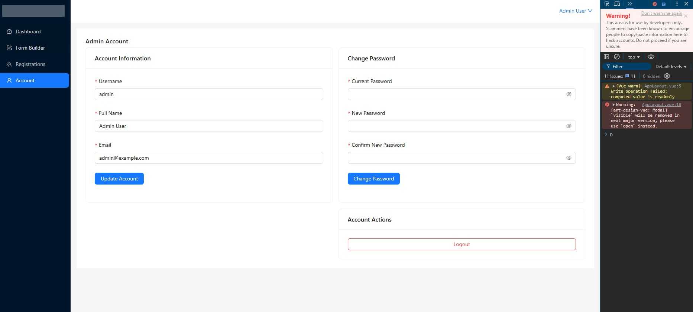

# vue-case-study-v1

This is a case study using vue3 composition api, vuex for statemanagment and antdesign

## How To Run

after pulling the project and installing dependencies, run the script "npm run dev" and enter user name: "admin" and password: "password" to login as admin.

## Login Page

## Dashboard

## Form builder

## Account Settings

